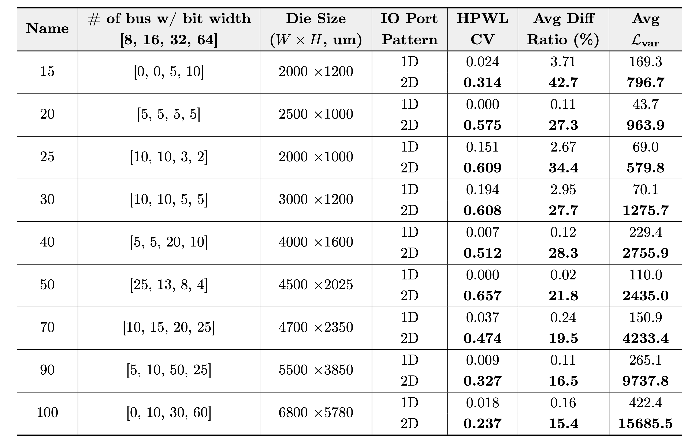

# Benchmark Description

To emulate new bus routing challenges(e.g., 2D-placed bus pins), we developed a new bus routing benchmark by extending the ICCAD 2018 benchmark suite[1]. First, we construct nine distinct netlists varying in bus width/count configurations. Then, for each netlist, we create two floorplan variants, 1D-placed and 2D-placed, by changing die width, height, pin placement, and routing blockages. The 1D set is included specifically to highlight that the 2D pin placement exhibits larger intra-bus HPWL variation compared to the 1D case. In total, we provide a set of 18 routing benchmarks designed to evaluate bus routing under different I/O pin configurations:

---

## 1. Benchmark Sets

### 1.1 1D_placed_designs (Total 9 benchmarks)

Directory structure:
- `bus_design_XX`
  - `bus_XX_def.tar.gz`
  - `bus_XX.png`
  - `bus_XX.v`

Description:
- 9 benchmarks with conventional 1D pins

### 1.2 2D_placed_designs (Total 9 benchmarks)

Directory structure:
- `bus_design_XX`
  - `bus_XX_def.tar.gz`
  - `bus_XX.png`
  - `bus_XX.v`

Description:
- 9 benchmarks with 1D & 2D pins

All benchmark layouts were implemented using a commercial tool, Innovus v21.16 [2]. The 2D placed benchmarks were constructed through custom DEF generation.

---

## 2. Bus Configuration

Each benchmark includes buses with four different bus widths:
- 8-bit, 16-bit, 32-bit, and 64-bit

---

## 3. Pin Placement Structure

- **1D_placed Benchmarks**:  
  All input/output pins are placed along the die boundary.

- **2D_placed Benchmarks**:
  - Input pins remain on the die boundary.
  - Output pins are placed inside the die as 2D pins, modeled after TSV-based connections.
  - Each 2D pin uses a 5 × 5 µm² metal pad on the M5 layer, matching top BEOL via dimensions and routing track pitch.

---

## 4. Routing and Blockage Configuration

- Detailed routing is completed using [2].
- Pins are located on M5.
- Routing blockages are inserted on M3 and M4 to represent preserved routing regions, effectively constraining available routing space for buses.

---

## 5. Benchmark Overview Figure

  

---

## Reference

[1] A. Liao, H. Chang, O. Chi, and J. Wang. (2018). ”ICCAD 2018 CAD Contest Obstacle-Aware On-Track Bus Routing” [Online]. Available: https://drive.google.com/file/d/16dNYQDnR9aUZ4F6cs33X-MeWjXOM8vfn/view  
[2] "Cadence Innovus User Guide," http://www.cadence.com.
